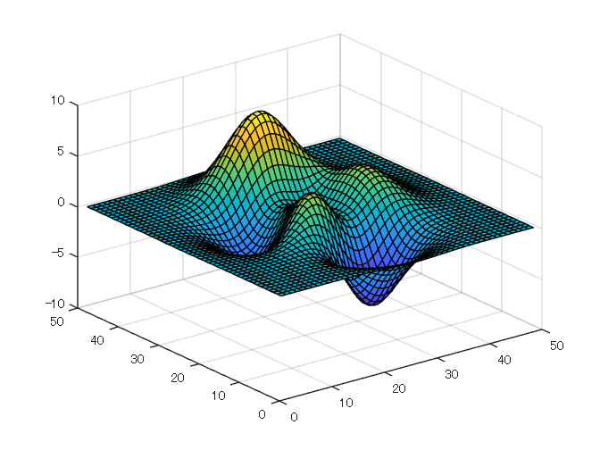
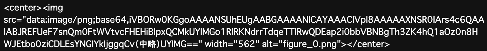
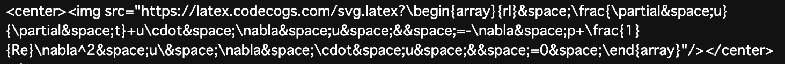

# <span style="color:rgb(213,80,0)">R2023b で markdown 変換できるようになった</span>

export 関数（[LINK](https://jp.mathworks.com/help/matlab/ref/export.html?lang=en)）がついに livescript から markdown (Jupyter® notebook も）への変換が公式サポートされるようになりました。Doc は英語で表示しないと R2023b (最新版）の内容が表示されないので要注意です。


正確な仕様はドキュメントを確認するとしても、ちょっとややこしいので markdown 変換に絞って使い方例をまとめます。

-  使用環境：R2023b 


これまでは自作の livescript2markdown 関数を使用していましたが、これを機に [export 関数](https://jp.mathworks.com/help/matlab/ref/export.html?lang=en)を使うようにしたいと思います。


参考：[【MATLAB】ライブスクリプトの Markdown 変換で楽して Qiita 投稿](https://qiita.com/eigs/items/513a17bd8cb2c5c5f435)

## 準備

変換後の markdown を確認するために画像やら数式を入れておきます。

### 数式
 $$ \begin{array}{rl} \frac{\partial u}{\partial t}+u\cdot \nabla u & =-\nabla p+\frac{1}{Re}\nabla^2 u\\ \nabla \cdot u & =0 \end{array} $$ 
### 画像
```matlab
surf(peaks);
```

<center></center>

# デフォルトの動作
```matlab
export("doc.mlx","doc_ver1.md");
```

結果はこちら：[doc_ver1.md](doc_ver1.md) 


ファイルを見ると数式は

<pre>
 $$ \begin{array}{rl} \frac{\partial u}{\partial t}+u\cdot \nabla u & =-\nabla p+\frac{1}{Re}\nabla^2 u\\ \nabla \cdot u & =0 \end{array} $$ 
</pre>

そして画像は

<p style="text-align:left"></p>


こんな感じ。画像が埋め込まれちゃってますね。画像等のファイルを出さずに markdown ファイル１つで済む点はメリットですが、画像ファイルも欲しい（個別に確認したい）場合は不便ですね。


ちなみに、

<pre>
export("myscript.mlx",Format="markdown")
</pre>

livescript 名と同じ markdown ファイルですとこんな実行方法でもOK.

# 画像ファイルも作る場合

画像ファイルを別途作成させる場合はこれ。`EmbedImages` オプションを設定します。

```matlab
export("doc.mlx","doc_ver2.md",EmbedImages=false);
```

結果はこちら：[doc_ver2.md](doc_ver2.md) 


今度は

<p style="text-align:left"></p>


と、画像ファイルを参照しています。


画像ファイルは (markdown ファイル名)_media のフォルダ内に保存されますね。今回のケースですと [<samp>doc_ver2_media</samp>](doc_ver2_media) です。


ちなみに画像ファイル形式は FigureFormat から選べますが、<samp>Run</samp> オプションを <samp>true</samp> にし markdown 変換前に一度 livescript を実行させるようにしないといけない点に要注意。

<pre>
export("doc.mlx","doc.md",EmbedImages=false, FigureFormat='jpeg', Run=true);
</pre>

選べる選択肢は以下の通り


**<samp>FigureFormat</samp>** **—** **Figure format**


<samp>"png"</samp> | <samp>"jpeg"</samp> | <samp>"bmp"</samp> | <samp>"svg"</samp> | <samp>"eps"</samp> | <samp>"pdf"</samp>

# 数式は画像で表示したい場合

少し前まで GitHub がそうでしたが、 latex がレンダリングされない環境だと数式は画像にして表示しましょう。<samp>RenderLaTeXOnline</samp> オプションです。<samp>"svg"</samp> | <samp>"png"</samp> | <samp>"jpeg"</samp> から選べますが、ここでは <samp>"svg"</samp> で行ってみます。

```matlab
export("doc.mlx","doc_ver3.md",RenderLaTeXOnline='svg');
```

結果はこちら：[doc_ver3.md](doc_ver3.md) 


数式部分は

<p style="text-align:left"></p>


こんな感じで latex.codecogs.com のサービスを利用しています。


便利なのですがダークモードで表示すると見えない、見にくいなどの課題がある点は要注意です。

# その他使うかもしれないオプション
### **<samp>IncludeOutputs</samp>** **—** <samp>true</samp> or <samp>1</samp> (default) | <samp>false</samp> or <samp>0</samp>

コードの出力結果を含めるかどうか。デフォルトでは <samp>true</samp> になってます。

### **<samp>Run</samp>** **—** <samp>false</samp> or <samp>0</samp> (default) | <samp>true</samp> or <samp>1</samp>

変換前に一度コードを実行するかどうか。デフォルトでは false になってます。まだ実行していない livescript で出力が欲しい場合は実行した方がいいですね。

### **<samp>HideCode</samp>**  **—** <samp>true</samp> or <samp>1</samp> | <samp>false</samp> or <samp>0</samp>

コードを隠しての出力。基本的に livescript 側の設定（表示・非表示）に従いますが、このオプションで指定可能。

### **<samp>AcceptHTML</samp>** **—** <samp>true</samp> or <samp>1</samp> (default) | <samp>false</samp> or <samp>0</samp>

細かい色の設定（タイトル）や挿入した画像のサイズなどしっかり markdown にも反映させたい場合に必要。ただ表示側の環境に依存します。

### **<samp>FigureResolution</samp>** **—** <samp>600</samp> (default) | positive integer

画像の解像度設定ですね。

# まとめ

以上！基本的なところだけですが簡単に紹介いたしました。


```matlab
export("doc.mlx","README.md",EmbedImages=false);
```

でこの repo の README としておきます。


個人的には、[【MATLAB】ライブスクリプトの Markdown 変換で楽して Qiita 投稿](https://qiita.com/eigs/items/513a17bd8cb2c5c5f435) で紹介した関数・コードが製品に（開発チームの大幅な修正・慎重な検証ののち）採用されたということで思い入れの強い関数 [export](https://jp.mathworks.com/help/matlab/ref/export.html?lang=en) でした。

